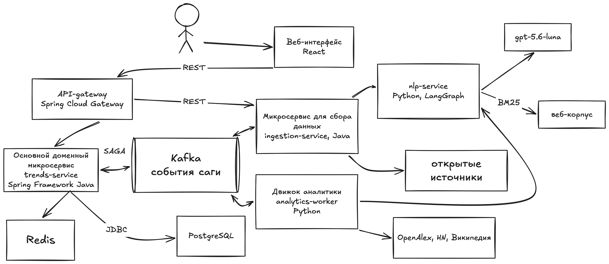

# Hiddenjem — техническая документация

Краткое описание пайплайна обработки данных и методологии, по которой система отличает слабый
сигнал от зрелой технологии, хайпа и шума. Как развернуть — в [README](../README.md), метрики — в
[metrics.md](metrics.md).

## 1. Что считается слабым сигналом

Тема попадает в выдачу, только если выполнены все четыре условия:

1. **Технология.** Конкретный метод, механизм, класс продуктов, протокол или бизнес-применение, а
   не общее понятие, обрывок фразы, событие компании или один продукт.
2. **По теме запроса.** Эксперт направления признал бы её своей.
3. **Ранняя стадия.** Прототипы, пилоты, первые продукты у нескольких компаний, ранние раунды. Не
   мейнстрим: не то, что уже штатно есть в крупных фреймворках и облаках, продаётся десятками
   вендоров или исследуется с 2021 года и раньше.
4. **Подтверждение.** Есть источники 2024–2026 годов, где речь именно об этой технологии, от двух и
   более независимых организаций.

Первые три условия проверяются правилами, моделью и экспертной стадией (раздел 4), четвёртое —
правилами достоверности над собранными документами.

## 2. Архитектура



Исходник схемы — [architecture.puml](architecture.puml) (PlantUML).

| Компонент | Роль | Технологии |
|---|---|---|
| frontend | Запуск анализа, прогресс в реальном времени, отчёты, карточки тем, радар | React, TypeScript, nginx |
| gateway | Единая точка входа, лимит запросов, CORS, заголовки безопасности | Java 21, Spring Cloud Gateway |
| trends-service | Оркестратор саги: ведёт заявку по шагам, хранит отчёты и их версии, обратную связь | Java 21, Spring Boot, PostgreSQL, Redis |
| ingestion-service | 25 коннекторов к источникам, очистка, дедупликация, неизменяемый снимок корпуса | Java 21, Spring Boot, Resilience4j |
| analytics-worker / analytics-api | Выделение тем, оценка, отбор, сборка карточек | Python, FastAPI, numpy, scikit-learn |
| nlp-service | Агент-исследователь, LLM-эксперты, переранжирование, перевод, поиск по веб-корпусу | Python, FastAPI, LangGraph, OpenAI-совместимый API |
| Kafka (Redpanda) | Команды и события саги | Kafka API |
| PostgreSQL, Redis | Документы, заявки, отчёты; кэш, квоты, поток прогресса | — |

Принципы:

- каждый сервис владеет своей схемой БД, доступ к чужим схемам закрыт;
- долгие шаги асинхронны: интерфейс получает прогресс потоком Server-Sent Events;
- все обращения к языковой модели собраны в одном сервисе (nlp-service);
- контракты команд и событий — JSON Schema в `contracts/schemas`, REST — OpenAPI в
  `contracts/openapi/horizon-api.yaml`.

### Сага одного анализа

1. `POST /api/v1/research-requests` — trends-service создаёт заявку и публикует
   `CollectDomainCorpus`.
2. ingestion-service собирает корпус по направлению и отвечает `CorpusCollected` со ссылкой на
   неизменяемый снимок.
3. trends-service публикует `AnalyzeDomain`; analytics-worker забирает снимок у ingestion-service,
   считает темы и отвечает `DomainAnalyzed`.
4. trends-service сохраняет отчёт (`TrendReportGenerated`) и закрывает заявку.

Прогресс каждого шага идёт событиями `*-progressed` и доходит до браузера через SSE.

### Отказоустойчивость

- **Идемпотентность.** Запуск анализа принимает заголовок `Idempotency-Key`, обработчики событий
  хранят обработанные сообщения, публикация идёт через outbox — повтор команды не создаёт второй
  отчёт.
- **Сага с дедлайном.** Шаг, не уложившийся в срок (60 мин в быстром режиме, 90 мин в качественном),
  завершает заявку с понятной причиной, а не зависает.
- **Изоляция источников.** У каждого коннектора свой лимит частоты, повторы с экспоненциальной
  задержкой и предохранитель (circuit breaker). Отказ источника не валит сбор: отчёт помечается
  неполным и называет, какие источники не ответили.
- **Деградация без модели.** Если языковая модель недоступна, анализ завершается по правилам и
  разметке корпуса; экспертная стадия и перевод пропускаются.
- **Недоставленные сообщения** после нескольких попыток уходят в `<topic>.dlq`.

## 3. Пайплайн обработки данных

### 3.1. Запрос

Аналитик вводит направление в свободной форме, выбирает режим (быстрый или качественный), число
тем (5–50, по умолчанию 15) и окно лет (3–15, по умолчанию 7). Направление сопоставляется с
перекрёстным словарём из 165 записей (`direction_lexicon.txt`): формулировка → предметные метки и
коды источников для прицельного поиска.

### 3.2. Сбор и очистка (ingestion-service)

| Тип | Источники | Что дают |
|---|---|---|
| Наука | OpenAlex, arXiv, Crossref, Semantic Scholar, Europe PMC, alphaXiv, The Lens | Ранние исследования, препринты, цитирования, аффилиации |
| Патенты | The Lens (все ведомства), USPTO | Защита технологии, корпоративный интерес |
| Код и сообщество | GitHub, Hacker News, Хабр, Product Hunt | Реализации, интерес разработчиков, первые продукты |
| Рынок и пресса | Отраслевые издания, GlobeNewswire, PR Newswire, GDELT, RSS | Продукты, пилоты, сделки |
| Гранты и регуляторы | SBIR, NSF, SEC EDGAR, IETF, регуляторы и центробанки | Финансирование, стандарты, песочницы |
| Веб-корпус и агент | Заранее собранный корпус по 39 направлениям, агент-исследователь | Продуктовые сигналы, которых нет в API |

- Все источники опрашиваются параллельно; бюджет корпуса делится между ними.
- **Вторая волна.** Языковая модель предлагает узкие поисковые фразы трёх типов — ядро направления,
  новое, пограничное — на английском, русском и китайском.
- **Агент-исследователь** (LangGraph) сам ищет, читает страницы и записывает найденные технологии.
  Имя принимается, только если оно есть на прочитанной странице. Быстрый режим — до 6 минут и
  30 страниц, качественный — до 20 минут и 90 страниц.
- **Перевод.** Документы на русском и китайском переводятся на английский для извлечения тем.
- **Дедупликация** по DOI, идентификатору arXiv или сочетанию «заголовок + авторы + год».
- **Релевантность.** Отсекаются документы, где запрос на самом деле не упоминается.
- **Снимок.** Корпус фиксируется неизменяемым снимком: один и тот же снимок всегда даёт один и тот
  же результат анализа.
- **Правила сбора.** Соблюдается robots.txt, запросы подписаны контактом, у каждого источника свой
  лимит частоты и автоматическое отключение при сбоях. Источники, которым нужен ключ, без ключа не
  опрашиваются.

### 3.3. Выделение тем (analytics)

1. **Корпус анализа.** До 1 500 документов за окно лет, пропорционально по годам — чтобы не
   исказить динамику.
2. **Термины.** Фразы из 1–4 слов; остаются похожие на устойчивые названия технологий (termhood по
   C-value и YAKE), общеупотребимые обороты и обрывки предложений отсекаются.
3. **Темы.** Термины превращаются в векторы (TF-IDF по словам и символьным n-граммам, сжатие SVD до
   384 измерений). Синонимы сливаются (косинус ≥ 0,90), похожие термины объединяются в темы
   агломеративной кластеризацией (порог расстояния 0,35); название теме даёт самый характерный её
   термин.
4. **Технологии извне.** К темам корпуса добавляются имена в порядке приоритета:
   - сигналы веб-корпуса, заранее размеченные через LLM по тем же четырём критериям, что применяют
     эксперты (раздел 1);
   - технологии, найденные агентом-исследователем по этому запросу;
   - панель LLM-экспертов по веб-корпусу;
   - имена, предложенные языковой моделью.

   Каждое имя попадает в отчёт, только если источники внутри окна лет подтверждают его
   документами от двух и более независимых организаций. Выдача не формируется только по знаниям
   модели.
5. **Проверка принадлежности.** Остаются темы, чьи документы заметно чаще относятся к запрошенному
   направлению, чем в среднем по корпусу.

### 3.4. Оценка

Каждая тема получает балл от 0 до 100:

```
балл = 0,5 · методология зарождения + 0,5 · модель внешних признаков
       + надбавки (alphaXiv, независимые площадки, переранжирование)
```

**Методология зарождения** — шесть индикаторов в `[0, 1]`, свёрнутые взвешенным геометрическим
средним `ES = 100 · Π xₖ^wₖ` (некомпенсирующая свёртка: провал одного свойства нельзя закрыть
избытком другого).

| Индикатор | Вес | Что измеряет |
|---|---|---|
| novelty | 0,20 | Новизна: `exp(−возраст / 3 года)` от первого достоверного упоминания |
| growth | 0,30 | Рост: наклон `ln(df + 1)` по годам (МНК), нормирован на утроение за год |
| diffusion | 0,15 | Распространение: энтропия по классам источников, число организаций и площадок |
| weakness | 0,15 | Слабость: обратный объём за последние 2 года — массовая тема не слабый сигнал |
| coherence | 0,10 | Связность: близость членов темы к центроиду и NPMI совместной встречаемости |
| impact | 0,10 | Потенциал: скорость цитирования, доля патентов, доля участия компаний |

**Модель внешних признаков** — логистическая регрессия по 16 признакам: насколько тема уже известна
миру за пределами собранного корпуса (раздел 5). Если внешних данных о теме нет, модельная часть
равна своему базовому значению и тему не наказывает.

**Надбавки:** +6 за каждую статью alphaXiv, где тема названа (не больше +18); +3 за каждое удвоение
числа независимых площадок у предложенной темы (не больше +8); до +10 по итогам переранжирования.

### 3.5. Отбор

1. **Правила.** Сразу отсекаются: общеупотребимые обороты и не-технологии; темы не по направлению;
   мейнстрим направления (заметная доля его литературы) и массовые за пределами корпуса; зрелая
   стадия жизненного цикла (рост прекратился или ушёл в патенты); медийная видимость без научной
   основы; темы без источников за последние три года; слабо подтверждённые; повторы уже вошедших
   тем; скрытые аналитиком как шум. Каждая причина с примерами видна в отчёте на вкладке
   «Что не попало».
2. **Переранжирование.** Модель получает 40 лучших тем с фрагментами источников и расставляет их по
   порядку: выше — самые ранние и близкие к запросу. Заодно снимает то, что проскочило правила:
   новости о сделках, отдельные продукты, давно массовые технологии.
3. **Экспертная стадия.** Три LLM-эксперта по той же карточке, которую увидит аналитик, отвечают
   «да» или «нет» каждый на свой вопрос:
   - **отрасль** — относится ли тема к запрошенному направлению;
   - **рынок** — ранняя ли это стадия, а не массовая технология;
   - **доказательства** — подтверждают ли источники описание темы и есть ли среди них свежие,
     2024–2026 годов.

   Сигналы веб-корпуса, размеченные заранее, получают готовый вердикт разметки. Порядок в отчёте:
   одобренные разметкой, затем одобренные всеми тремя экспертами, затем по числу «да». Тема,
   отклонённая всеми тремя, и отклонённая тема без определения по источникам в отчёт не попадают.
   Балл сдвигается вместе с порядком: ниже по списку балл не растёт.
4. **Лучше короче, чем непроверенное.** Если проверенных тем меньше, чем запрошено, отчёт короче.

### 3.6. Карточка темы

- **Определение** берётся из самих текстов, при выводе переводится на русский; у каждого
  переведённого поля отмечено, какая модель его дала и как (генерация или машинный перевод).
- **Источники** — до 20 документов, в которых тема упоминается (не больше 10 одного класса), с
  названием, ссылкой, датой, типом источника, языком оригинала и уровнем доверенности.
- **Пример организации** — только из документа, где тема названа прямо.
- **Почему это слабый сигнал** — голоса экспертов с причинами, из чего сложился балл (вклад
  методологии, модели и надбавок, три самых сильных признака модели), расчёт уверенности и сводка по
  источникам.
- **Уверенность** — сила доказательной базы:
  `0,35 · объём документов + 0,25 · разнообразие классов источников + 0,20 · качество линии роста
  (скорректированный R²) + 0,20 · покрытие лет`. Ниже 0,40 — отметка «низкая доказательная база».
- Тема, все источники которой — медиа и пресс-релизы, помечается пониженной доверенностью.

## 4. Интерпретируемость

- Балл раскладывается на вклады: шесть индикаторов методологии, признаки модели, надбавки.
- Для каждой исключённой темы указана причина; на вкладке «Что не попало» — число исключённых по
  каждой причине с примерами и поиск «почему темы нет в отчёте»
  (`GET /api/v1/reports/{id}/explain`).
- Решение по каждой строке размеченного датасета объясняется числами (см.
  [dataset-validation.md](dataset-validation.md)).

## 5. Методология отбора признаков

### Модель внешних признаков

Задача модели — отличить технологию, о которой мир ещё почти не знает, от уже массовой. Поэтому
признаки описывают известность и динамику темы в независимых открытых источниках, а не текст её
названия.

| Группа | Признаки | Зачем |
|---|---|---|
| Корпус | `corpus.documents`, `corpus.documents_last_year`, `corpus.recent_two_year_share`, `corpus.growth_slope` | Объём и динамика темы в собранных документах |
| OpenAlex | `openalex.works_window_total`, `openalex.works_last_year`, `openalex.recent_two_year_share`, `openalex.distinct_institutions`, `openalex.top_institution_share` | Масштаб науки, свежесть, сколько организаций работает — одна лаборатория или десятки |
| Hacker News | `hackernews.mentions_window_total`, `hackernews.mentions_last_year`, `hackernews.recent_two_year_share` | Внимание разработчиков — ранний признак практического интереса |
| Википедия | `wikipedia.exists`, `wikipedia.age_days`, `wikipedia.size_bytes`, `wikipedia.pageviews_12m` | Энциклопедическая зрелость: давняя большая статья с высоким трафиком — признак мейнстрима |

Как отбирались признаки:

- **Только измеримое вне корпуса и по дате.** Счётчики берутся за окно наблюдения и последний год;
  доли свежего объёма нормируют масштаб, чтобы сравнивать большие и малые области.
- **Без утечки метки.** Название темы, текст и поля эталонной таблицы в признаки не входят. Замеры
  качества проводятся внутри одного временного среза: при сравнении разных лет модель учила бы
  календарь, а не зрелость.
- **Пропуск — не ноль.** Если источник не ответил, признак отмечается как отсутствующий и
  заполняется нейтрально; отказ источника не выглядит как «о теме ничего не известно».
- **Лог-преобразования** счётчиков и нормировка обучаются только на обучающей части.

Артефакт модели (`services/analytics-service/src/horizon_analytics/resources/signals-model.json`)
хранит список признаков, преобразования, веса, смещение, версию, дату обучения и метрику на
отложенной выборке. Путь к своему артефакту задаётся `HORIZON_SIGNALS_MODEL`.

### Обучение модели

Два шага в `services/analytics-service` (окружение — `make venv`):

```bash
# 1. Признаки по списку технологий из открытых источников (кэшируются, прерывание безопасно)
.venv/bin/python -m horizon_analytics.signals.collect --terms terms.json --out signals.jsonl

# 2. Обучение: метки — JSON {"термин": 1|0} или CSV с колонками term,label
.venv/bin/python -m horizon_analytics.signals.train \
    --features signals.jsonl --labels labels.json --out signals-model.json
```

- **Модель.** Логистическая регрессия (scikit-learn, L2, сбалансированные веса классов).
- **Признаки.** Счётчики сжимаются `log1p`, затем каждый признак стандартизуется по обучающей
  части. Признак без разброса получает нулевой вес.
- **Отложенная часть.** 25 % примеров, стратифицированно по метке. С `--group-by-area`
  откладываются области целиком. Центр, масштаб и веса считаются без неё, и поставляется
  именно модель, обученная без отложенной части.
- **Метрика.** ROC-AUC на отложенной части считается загруженным артефактом, тем же кодом,
  которым движок применяет модель. Разойтись обучение и применение не могут: вектор строится одной
  функцией `signals.features.external_features`.
- **Пропуски.** Отсутствующий признак равен центру обучающей части, как и при применении.

### Правила решения на размеченном датасете

Для замера на датасете кейса (Precision/Recall/F1) по каждой технологии собираются ряды по годам из
OpenAlex, arXiv, GitHub, Hacker News и Википедии. Решение «слабый сигнал» выносится по абсолютным
порогам:

| Правило | Порог |
|---|---|
| Мейнстрим: научных работ за 3 года больше | 3 000 |
| Зрелость: энциклопедической статье больше | 5 лет и 30 000 знаков |
| Доказанность: независимых видов источников не меньше | 2 |
| Зарождение: первое достоверное упоминание не раньше | окна в 6 лет |

Каждое решение сопровождается числами и текстовым объяснением.

## 6. Языковые модели

Все обращения к модели идут через nlp-service к OpenAI-совместимому API модели из перечня ТЗ
(по умолчанию `gpt-5.6-luna`). Модель используется для расширения запроса, агента-исследователя,
переранжирования, экспертной стадии и перевода. Каждое место, где текст дала модель, помечено в
отчёте. Предразметка веб-корпуса по критериям раздела 1 выполнена через LLM заранее и хранится
вместе с корпусом.
